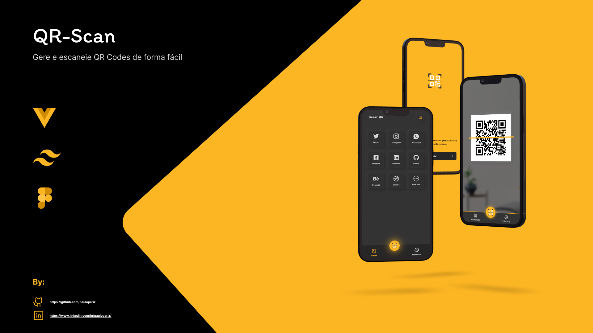

<h1 align="center">QR-Scan</h1>

 

Com o <a href="https://app-qr-scan.vercel.app/"> QR-Scan</a>, você pode criar e escanear QR Codes de forma rápida e fácil. Use-o para gerar QR Codes para suas redes sociais favoritas, como Instagram, Twitter, LinkedIn, ou mesmo para seu site pessoal. Experimente agora e veja como é simples!

 

    

 
 

## ⚡ Gerar QR-Code:
##### Com o QR-Scan, você pode gerar códigos QR para diversas redes sociais e sites, simplesmente inserindo um nome de usuário ou URL correto. Seu código QR estará pronto em questão de segundos.

 

## ⚡ Escanear QR-Code:
##### Leia vários QR Codes aqui com sucesso! Lembre-se de limpar a câmera e centralizar o QR Code para que seja lido com precisão.

 

---

 

## 🛠︎ Principais ferramentas utilizadas:

 

|              |                                                   |
| :----------------: | :---------------------------------------------------: |
|         |    `VUEJS`   |
|         |    `JAVASCRIPT`   |
|         |    `TAILWIND`   |
|         |    `FIGMA`   |

 
 

## 📚︎ Algumas Bibliotecas:
- vue-barcode-reader
- node-qrcode
- Moment
- Animate.css

 

---

 

## ➕ Mais detalhes:

- Este projeto foi desenvolvido especialmente para dispositivos móveis, mas também foi adaptado para ser visualizado em desktops.
- Após gerar o QR Code, você pode fazer o download e utilizá-lo como desejar.
- Configurações de ativar e desativar vibrações.
- Registro histórico de todos os QR codes gerados e escaneados.
- Selecione o filtro para ordenar o histórico por data, escolhendo entre as opções 'mais recentes' e 'mais antigos'.

 

---

 
 

## 📍 DEPLOY:
- <a href="https://app-qr-scan.vercel.app/">CLIQUE AQUI PARA VER O PROJETO</a>

 

## 🧠 Autor

- [@paulopariz](https://www.linkedin.com/in/paulopariz/)

  

<h2 align="center">Contato:</h2>

    

 
